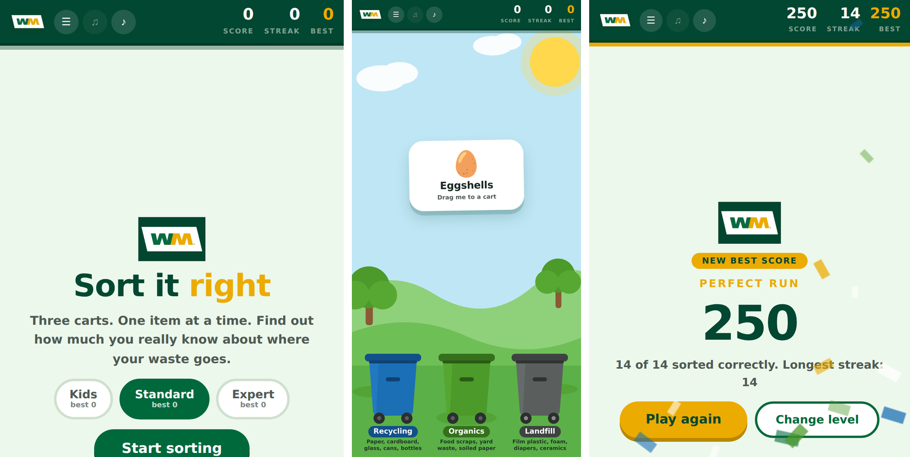

<div align="center">



# 🗑️ Sort It Right

**A drag-and-drop recycling game for WM educational outreach events.**

Blue, green, or grey? Find out how much you really know about where your waste goes.


**[▶ Play it live](https://YOUR-USERNAME.github.io/YOUR-REPO/)** — *update this link once GitHub Pages is on*

</div>

---

## What it is

A single-page browser game built for tabling events, classroom visits, and community outreach. Someone scans a QR code, picks a difficulty, and drags 10–16 items into the correct WM cart — recycling, organics, or landfill. Every answer, right or wrong, comes with a one-line reason, so it works as a teaching moment even when someone gets it wrong.

No app to install, no account, nothing collected about players. It's one HTML file that runs entirely in the browser.

<div align="center">

</div>

## Features

- **Three difficulty levels** — Kids (10 easy items), Standard (14, adds common mix-ups), Expert (16, the genuinely tricky ones)
- **50 items total**, each level draws a fresh random set so replays don't repeat
- **Drag-and-drop or tap** — the item physically flies into whichever cart you choose, right or wrong, so the feedback always matches your action
- **High scores saved per level**, right in the browser, no account needed
- **Background music** — four in-browser generated tracks (Off / Sunny / Breezy / Parade), toggled independently from sound effects
- **Fully responsive** — phones, tablets, laptops, and phone landscape
- **Accessible** — full keyboard support (1 / 2 / 3), visible focus states, respects reduced-motion preferences

<div align="center">

</div>

## Play it

| Level | Items | Best for |
|---|---|---|
| 🧸 Kids | 10 | Everyday, obvious items — bananas, bottles, boxes |
| ⚖️ Standard | 14 | Adds the classic mix-ups — greasy pizza boxes, lined coffee cups |
| 🎓 Expert | 16 | The genuinely tricky ones — receipts, compostable cutlery, shredded paper |

**Controls:** drag the card onto a cart, or tap a cart. Keyboard: `1` blue, `2` green, `3` grey.

## Deploying with GitHub Pages

This repo is set up to run directly from GitHub Pages with no build step.

1. Push this folder to a GitHub repository.
2. Go to **Settings → Pages**.
3. Under **Build and deployment**, set **Source** to `Deploy from a branch`.
4. Pick your default branch (usually `main`) and the `/ (root)` folder, then **Save**.
5. GitHub gives you a URL that looks like `https://your-username.github.io/your-repo/` — it can take a minute or two to go live the first time.
6. Update the **Play it live** link at the top of this README with that URL.

Once it's live, generate a QR code from that exact URL (any free QR generator works) and print it at least 2 inches square, with the URL underneath as a fallback for anyone whose camera doesn't cooperate.

## Editing the item list

Every item is one line inside the `ITEMS` array in `index.html`:

```js
{e:"🍌", n:"Banana peel", b:"organic", lv:1, w:"Food scraps become compost. In a landfill they make methane instead."}
```

| Field | Meaning |
|---|---|
| `e` | the emoji shown on the card |
| `n` | item name |
| `b` | correct cart — `"recycle"`, `"organic"`, or `"landfill"` |
| `lv` | difficulty — `1` easy, `2` common mistake, `3` expert |
| `w` | the one-line explanation shown after answering |

Add, remove, or edit entries freely — nothing else in the code needs to change.

> **Before an event, double-check the item list against your actual local service area.** Collection rules vary by hauler and city. The items most likely to differ: cartons, shredded paper, compostable serviceware, plastic tubs, food-soiled paper, and bones.
>
> Hazardous items (batteries, electronics, bulbs, paint) are deliberately left out — none of them belong in any of the three carts, so a three-button game can't represent them honestly.

## Project structure

```
.
├── index.html        # the entire game — markup, styles, and logic
├── wm-logo.svg        # WM logo, vectorized
├── assets/            # README screenshots
└── README.md
```

## Tech

Vanilla HTML, CSS, and JavaScript. No frameworks, no build tools, no package manager. Music and sound effects are generated live with the Web Audio API, so there are no audio files to host or license. High scores use `localStorage`.

## Credits & trademark note

Built by **Paul Alexander Consuelo-Valencia** for WM educational outreach events.

"WM" and the WM logo are trademarks of WM Intellectual Property Holdings, L.L.C., used here for an educational outreach activity. This is a community-built teaching tool, not an official WM product, unless stated otherwise by WM.

The game code in this repository is available under the [MIT License](LICENSE). The WM name and logo are **not** covered by that license and should not be reused outside of WM-related educational contexts.
